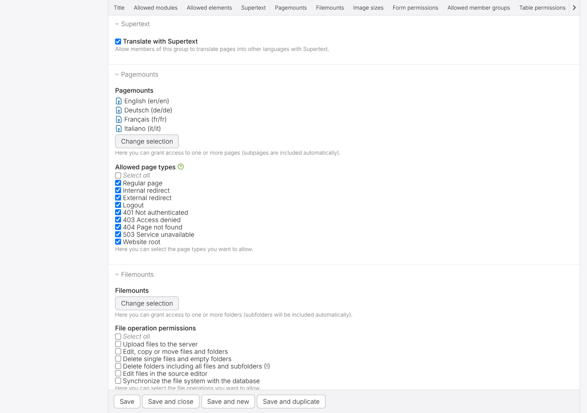

# Installation guide

For administrators who set up a Contao installation. Editors: see the [User guide](USER_GUIDE.md).

## Requirements

| | |
| --- | --- |
| Contao | 5.7 (LTS) or 6.0 |
| PHP | 8.3 or newer (Contao 6 needs 8.4) |
| Database | MySQL 8 or MariaDB 10.11+ (as required by Contao) |
| Multilingual site | One **website root per language** in the site structure, each with its own *Language* setting (e.g. `en`, `de-CH`, `fr-CH`) |
| Supertext | An API key with access to AI translation (<https://www.supertext.com/en/integrations/api>) |

The server must reach `https://api.supertext.com` over HTTPS.

Recommended: [terminal42/contao-changelanguage](https://extensions.contao.org/?p=terminal42%2Fcontao-changelanguage) for the language switcher on the website. When it is installed, translated pages are linked to their source automatically, so the switcher works without extra steps. On Contao 6, its current release (3.9) still requires some Symfony 7 packages; install it with `composer require -W terminal42/contao-changelanguage` so Composer may adjust them.

## Install

With the Contao Manager: search for `supertext/contao-supertext-translation` and install it. Then run the database update in the Contao Manager (or *Maintenance → Database update* / `contao:migrate`).

With Composer:

```bash
composer require supertext/contao-supertext-translation
vendor/bin/contao-console contao:migrate
```

Until the package is published on Packagist, add the GitHub repository first:

```bash
composer config repositories.supertext vcs https://github.com/Supertext/Contao-Supertext-Translation
composer require supertext/contao-supertext-translation:dev-main
```

The database update adds a few columns (`supertext_source` on pages, articles and content elements, and the `supertext` permission on users and user groups). No existing data is changed.

## API key

Set the key as an environment variable of the web server, or in the `.env.local` file of your Contao installation (never commit it):

```bash
SUPERTEXT_API_KEY=your-key-here
```

Without a key, the translate screen shows "No Supertext API key is configured" and the *Translate* button is disabled.

## Permissions

Administrators can always translate. For other users:

1. *User groups* (or the user) → **Supertext** → tick **Translate with Supertext**.
2. Make sure the group can edit the target language trees: the website roots of the other languages in *Pagemounts*, the page types in *Allowed page types*, and edit permission on those pages (*Site structure → page → Permissions*).



The *Translate with Supertext* icon only appears for users with the permission, and the translate screen only offers languages whose website root the user may edit.

## Language setup

Each website root's *Language* is sent to Supertext as the target language (`de-CH` stays `de-CH`); the source language is sent as its primary subtag (`de-CH` → `de`), because Supertext rejects regional source codes. Contao's own codes (`de`, `de-CH`, `fr`, `pt-BR`) need no setup.

If your roots use codes Supertext doesn't know, or you want formal/informal address, configure it in `config/config.yaml`:

```yaml
supertext_translation:
    language_map:
        de-CH: de-CH        # Contao language => Supertext code
    politeness:
        de-CH: more         # formal ("Sie"); "less" = informal
```

Target languages are the other website roots **of the same domain** (same *Domain name* setting) with a different language.

## All settings

`config/config.yaml` of the Contao installation:

| Setting | Default | Description |
| --- | --- | --- |
| `api_key` | `%env(SUPERTEXT_API_KEY)%` | Supertext API key. |
| `environment` | `live` | `live`, `staging` or `testing` Supertext API. May be an env variable. |
| `api_url` | `''` | Explicit API base URL (e.g. a proxy); overrides `environment`. |
| `language_map` | `{}` | Contao language → Supertext language code. |
| `politeness` | `{}` | Contao language → `default`, `more` (formal) or `less` (informal). |
| `poll_interval` | `2` | Seconds between status checks while Supertext translates. |
| `timeout` | `180` | Maximum seconds to wait for one page and language. |
| `fields` | see below | Which fields are translated, per table. |

### Translated fields

| Table | Fields (type) |
| --- | --- |
| Pages (`tl_page`) | `title`, `pageTitle`, `description` (text) |
| Articles (`tl_article`) | `title` (text), `teaser` (html) |
| Content elements (`tl_content`) | `headline`, `sectionHeadline` (inputUnit), `text`, `caption`, `mooHeadline` (html), `alt`, `imageTitle`, `summary`, `titleText`, `linkTitle`, `playerTitle`, `playerCaption` (text), `listitems` (list), `tableitems` (table) |

Add fields of your own content elements or switch defaults off:

```yaml
supertext_translation:
    fields:
        tl_content:
            myTeaserText: html     # text | html | inputUnit | list | table
            caption: false         # don't translate image captions
```

Not translated: page aliases (a new alias is generated from the translated title), URLs, images and other files, code and HTML elements, form fields, news, events and FAQ (see the roadmap in the [Developer guide](DEVELOPER.md)).

## Hosting notes

A translation runs while the editor waits (a few seconds per page; a whole site can take minutes). PHP's `max_execution_time` is lifted for the request; make sure your web server and proxies allow long requests (e.g. Apache `Timeout`, nginx `proxy_read_timeout` / `fastcgi_read_timeout` ≥ 300 s) when translating whole sites.

## Update

Contao Manager: update the package, then run the database update. Composer: `composer update supertext/contao-supertext-translation` and `contao:migrate`. See [CHANGELOG.md](../CHANGELOG.md).

## Uninstall

Remove the package (Contao Manager or `composer remove supertext/contao-supertext-translation`) and run the database update; it offers to drop the added columns. Translated pages stay as they are.

## Troubleshooting

| Symptom | Cause / fix |
| --- | --- |
| No translate icon in the site structure | The user lacks the Supertext permission (user group → Supertext), or the database update wasn't run. |
| "There is no other language of this website you may edit" | No other website root with a different language and the same domain, or the user can't edit those roots (pagemounts, page permissions). |
| "No Supertext API key is configured" | Set `SUPERTEXT_API_KEY` and clear the cache. |
| "Authentication failure" | Wrong key, or a key for another environment (`live` vs `staging`). |
| "Your Supertext translation limit is exceeded" | The Supertext subscription quota is used up. |
| `INVALID_LANGUAGE_PAIR` in the error | A root's language isn't a code Supertext knows; add a `language_map` entry. |
| "Timed out waiting…" | Very long page or slow service: raise `timeout`, and the web server timeouts. |
| "Insert tags were moved to the end…" | The translation lost the position of an insert tag; it was appended so nothing breaks. Check the text. |
| Language switcher doesn't show a translation | The translated page is still unpublished, or changelanguage isn't installed. |

Errors are also written to the Contao system log.
