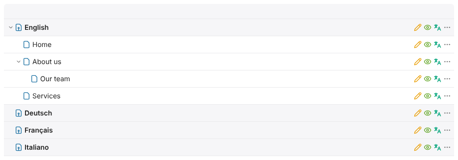
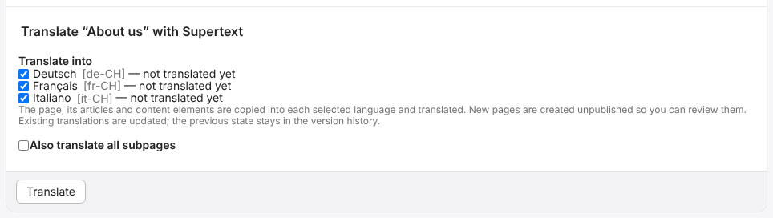
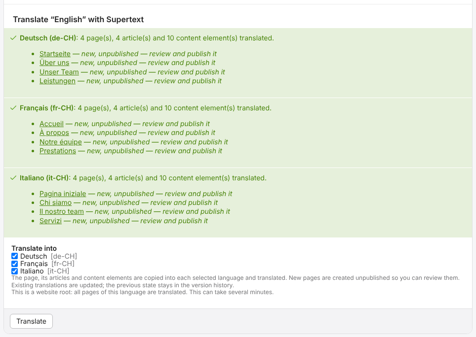
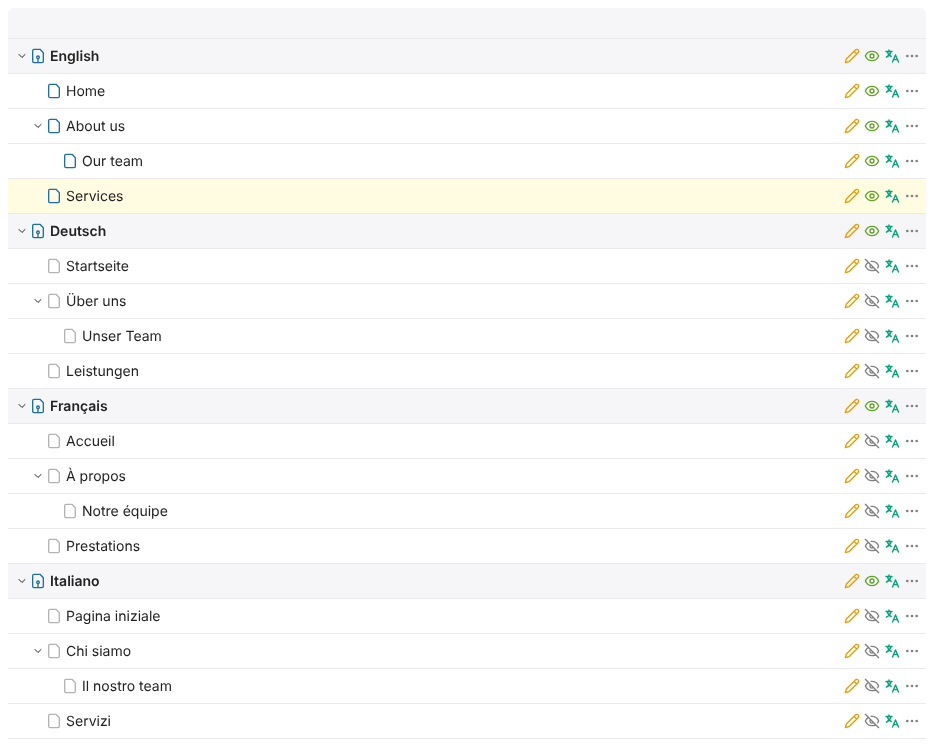
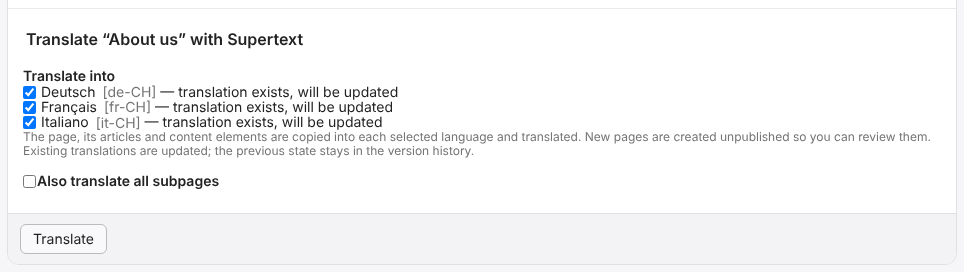
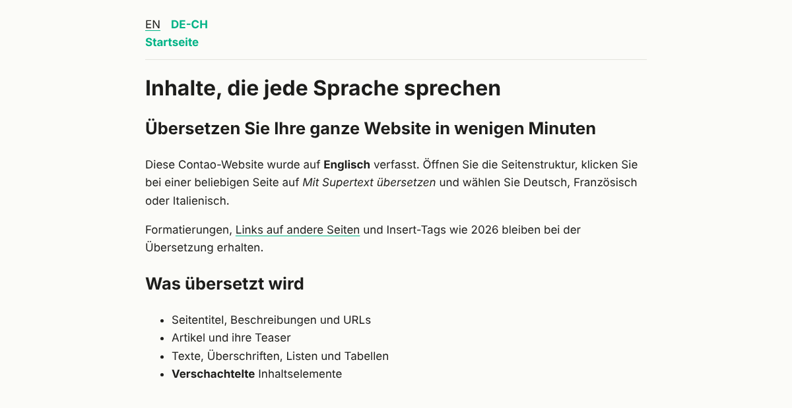

# User guide

For editors working in the Contao back end.

In Contao, each language of a website has its own page tree: one website root per language (e.g. *English*, *Deutsch*, *Français*). Supertext copies a page with its articles and content elements from one language into the others and translates the texts on the way.

## Translate a page

1. Open **Content → Pages** (site structure).
2. Click the **translate icon** (two letters, green) on the page you want to translate.

   

3. Choose the languages to translate **into**. "Not translated yet" means a new page will be created.
4. If the page has subpages, tick **Also translate all subpages** to translate the whole branch.
5. Click **Translate** and wait. One page takes a few seconds; keep the window open.

   

The result lists every language with the translated pages. Click a page to open its articles.

**Translate a whole website:** click the translate icon on the website root (e.g. *English*). All pages of that language are translated. This can take several minutes.

The new pages appear in each language's tree, unpublished (crossed-out eye):

**Translating again:** languages that already have a translation of the page show "translation exists, will be updated". Translating updates those pages in place (see below).

## Review and publish

- **New pages are created unpublished** (grey, crossed-out eye in the site structure). Check them, adjust if needed, then publish them like any other page: open the page settings (pencil), tick **Publish page** and save.
- **Existing translations are updated in place.** The previous version stays in the version history (*Restore* / version list of the record), so you can go back.
- If the translated page's parent doesn't exist in the target language yet, Supertext translates the parent too, so the page tree stays the same in every language.
- With the language switcher installed, translated pages are linked to their original: visitors can switch languages on the page.

## What is translated

- Page title, title tag and description (the page alias is generated from the translated title)
- Article titles and teasers
- Text, headlines, lists, tables, image texts (alt text, title, caption), link texts and video captions
- Content elements inside element groups and other nested elements
- Bold, italic, links and insert tags such as `{{link_url::12}}` are kept in place

## What is not translated

- URLs, images and files, code and HTML elements, forms
- News, events and FAQ (planned)
- Settings that are the same in every language (layout, CSS classes, …): these are copied from the source

## Things to know

- **Translating again overwrites manual changes** to the translated texts of that page. Make edits in the source language and translate again, or edit only after the last translation.
- Articles and elements you **add by hand** in a translated page are never touched.
- Articles and elements **deleted in the source** are hidden (not deleted) in the translations.
- Translate in one direction (e.g. always from English). Translating a translated page back would translate from that language.

## Messages

| Message | Meaning |
| --- | --- |
| *new, unpublished — review and publish it* | A new page was created; publish it when it's ready. |
| *… element(s) no longer in the source were hidden* | Elements removed in the source were hidden in this language. |
| *… text(s) came back empty from Supertext and kept the source text* | Check those texts in the translated page. |
| *No Supertext API key is configured* | Ask your administrator; the message links to the Supertext account signup and API key pages for them. |
| *There is no other language of this website you may edit* | Ask your administrator to create the language roots or give you access. |
| *Authentication failure* / *limit is exceeded* | Supertext account problem; ask your administrator. |
| *Timed out waiting…* | Try again, or translate fewer pages at once. |

If you don't see the translate icon, you don't have the Supertext permission. Ask your administrator.
